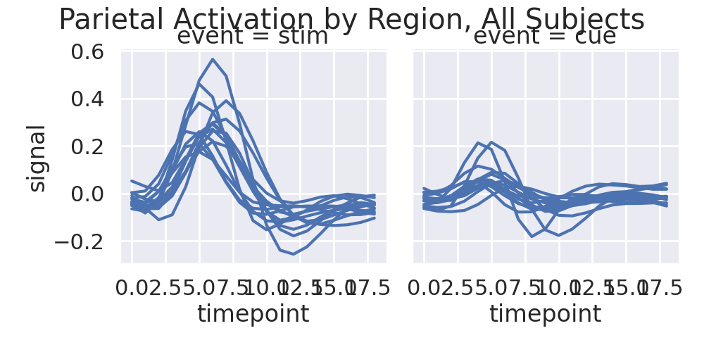
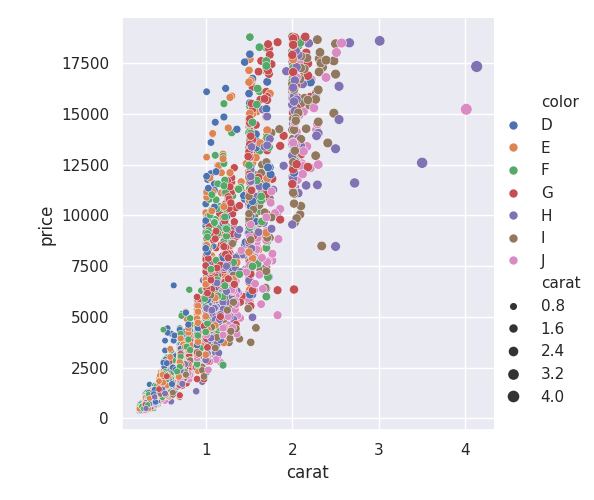
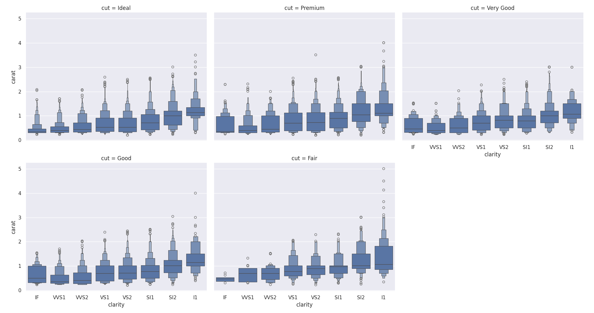

### Working with seaborn

In this assignment, I have made a few images using Seaborn in ways we have not
discussed in class.  Your task is to reproduce each of the images.  To do that
you'll have to look through the [Seaborn Tutorial](https://seaborn.pydata.org/tutorial.html)
and [Gallery](https://seaborn.pydata.org/examples/index.html) to find the features you
need, and then apply them to the right data.

Create a Jupyter notebook that reproduces the graphs, and then submit that notebook via Canvas.

# Problem 1
This image is done with the subset of records from the fMRI dataset for which "region" == "parietal".
I used `sns.plotting_context` to set the visual theme, `sns.relplot` to do the drawing, and
the matplotlib `suptitle` to set the overall title.  For full credit, you need to get the title
and plot aesthetics right, not just the drawing itself.

# Problem 2
This image was done using the "diamonds" sample dataset from Seaborn- you can load it under that
name just like we have been loading the "fmri" dataset.  The raw dataset has _too many_ diamonds
to make a good plot, so I used `pandas.DataFrame.sample()` to pick 10% of the diamonds at random.
Note that the size of the dots scales with the size of the diamond in carats.

# Problem 3
This is what is known as a "boxenplot", a kind of generalized boxplot.  There are two tricks here:
you need to get `sns.displot()` to produce the boxenplot and you need to convince it to divide the
row of output plots so that only 3 plots appear on the first line.

