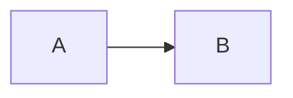

# My Notes #

## Does Mermaid Work Here?


Nope.


## How about here?
<pre class="mermaid">
graph LR
  a --- b & c --- d
</pre>
<script src="https://cdn.jsdelivr.net/npm/mermaid@10.9.1/dist/mermaid.min.js"></script>
Nope.


## Getting Started Questions:
* Do all students have B2 accounts? How are they accessed?
 * They are almost out of B2 units- need to get more?
* Do students run notebooks locally, or on B2/OpenAccess? Both.
* Who is running Windows at 32 bits?
* Do students know javascript? No.


## Getting Started Questions (2)
* Can students download and run something from git? They say yes, but
  it turns out to be no.


## Steps To Set Up Local Jekyll
Once the repo has been cloned, jekyll has to be set up in the new
clone.  Note that github pages need to be explicitly activated from
the github settings tab.

```
git submodule update --init  # to pull in the reveal.js submodule
gem install bundler -v 2.4.22
gem install jekyll
cd docs
cp ~/git/CMU-MS-DAS-Vis-S23/docs/Gemfile .  # to pick up customizations
bundle install
bundle exec jekyll serve  # starts the server on localhost
```


To Do:
* GitHub assignment: add a note about dealing with nano/pico
* Add some force to the prereqs.
* Clarify that some things with points attached happen in class


To Do (2):
* "Working with GGPlot" assignment: add a note that they should actually do
  it in ggplot.
* "Working with GGPlot" assignment: maybe include patchworklib ?


To Do (3):
* GraphVis assignment:
  * Add a test to the skeleton to detect invalid root directory setting
  * Add tests to the skeleton to check get_rel_paths base case and special cases


To Do (4):
* Seaborn assignment: can we make a version that does more with categorical data? Like
  continuous/non-continuous vs. color bars?


To Do (4):
* Tableau assignment: I'm not sure how to clarify the
  requirement that some data element needs to be "computed".


To Do (5):
* Intro/Syllabus: clarify that some points come from in-class exercises.


## Class Calendar:

Class starts Tue Jan 13 and runs through Feb 27 with no break.
11AM - 12:20PM

* Jan 13 (Tue): Block 1 part 1
* Jan 15 (Thu): Block 1 part 2
* Jan 20 (Tue): Git and GitHub
* Jan 22 (Thu): Block 1 colors, Block 2 contours and ggplot
* Jan 27 (Tue): Block 2 seaborn 1
* Jan 29 (Thu): Block 2 seaborn 2


* Feb 3 (Tue) Block 3 maps 1; please install GraphViz and Gephi
* Feb 5 (Thu): Block 3 maps 2, Block 4 web server
* Feb 10 (Tue): Block 4 graphs (incl Brendan/Gephi); please install Tableau
* Feb 12 (Thu): Block 4 D3; please install VisIt
* Feb 17 (Tue): Block 5 (Tableau)
* Feb 19 (Thu): Block 5 (Tableau) continued


* Feb 24 (Tue): Block 5 (Tableau) day 3
* Feb 26 (Thu): Block 6 (VisIt)


## Maps assignment update using geopy

This was originally suggested by Charlie Chen in S22.  This
approach assigns counties to many more of the snowfall locs
than the current method.  This is Chen's regex-based method,
with minor mods.

```
from geopy.geocoders import Nominatim
geolocator=Nominatim(user_agent="joel_learns_geopy")
county = []
for i in snow_df['Location']:
    loc = geolocator.geocode(i + ' Pennsylvania US')
    a = r', (.*?) County'
    if len(re.findall(a, str(loc)))>0:
        county_str = re.findall(a, str(loc))[0].split(" ")[-1]
    else:
        # Try without the suffix
        loc = geolocator.geocode(i)
        if len(re.findall(a, str(loc)))>0:
            county_str = re.findall(a, str(loc))[0].split(" ")[-1]
        else:
            county_str = ""
    print(i,": ",county_str)
    county.append(county_str)
```


### Assignments
1. matplotlib assignment (class 1)
2. grammar of graphics, seaborn (class 4)
4. maps (class 6)
5. Flask exercise happens in class
6. GraphViz (class 8)
7. Tableau (class 10 or 11?)
8. VisIt (class 12)


# LaTeX Math Example

A sample of LaTeX math, so I remember how to do it later:

`$$ J(\theta_0,\theta_1) = \sum_{i=0} $$`


<!-- .slide: data-background="#ff0000" -->
## Color Change Demo ##
This is just a demo of how to change slide color
Note:
This is a note.
