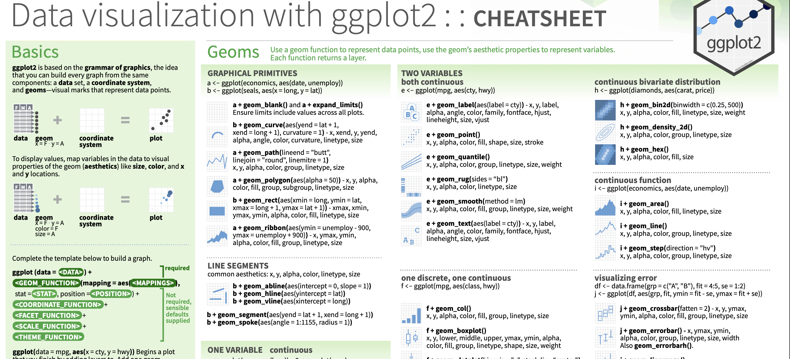

# Core logic of ggplot2

The **gg** in `ggplot2` stands for *grammar of graphics*.

All data visualizations are built from the same 3 core elements:

1.  data
2.  axes / coordinate system
3.  geoms / visual marks

GGPlot2 maps variables in the data to visual properties of the geoms (*aesthetics)*: x y, size, color, transparency, etc. etc.

# Link to ggplot2 cheat sheet

<https://rstudio.github.io/cheatsheets/html/data-visualization.html>



# Practice w ggplot2

## Libraries and setup

```{r}
library(here)
here::set_here("/path/to/project/folder/")
here()

library(tidyverse)


```

# Read in data and check it

```{r}
cmu_persistence_nonfirstgen <- read.csv(here("data/cmu-persistence-nonfirstgen.csv"))
cmu_persistence_firstgen <- read.csv(here("data/cmu-persistence-firstgen.csv"))
```

```{r}
head(cmu_persistence_firstgen)
```

```{r}
head(cmu_persistence_nonfirstgen)
```

# Tidying

First, let's stick our two tables together

```{r}
cmu_persistence_firstgen <- mutate(cmu_persistence_firstgen, 
                                   firstgen = TRUE)
                                   #Initial.Cohort.Size = parse_number(Initial.Cohort.Size))
cmu_persistence_nonfirstgen <- mutate(cmu_persistence_nonfirstgen, 
                                      firstgen = FALSE,
                                      Initial.Cohort.Size = parse_number(Initial.Cohort.Size))

data <- bind_rows(cmu_persistence_firstgen, cmu_persistence_nonfirstgen)
head(data)

```

Our life will be easier if these data are in a longer format.

```{r}
data_tidy <- data %>% 
  
  # rearrange longer
  pivot_longer(cols = c(3, 4, 5, 6, 7, 8),
               names_to = "sample_time",
               values_to = "persistence_rate"
              ) %>%
  
  # clean up some variable types we're at it
  mutate(
    sample_time = as.factor(sample_time),
    persistence_rate = parse_number(persistence_rate) / 100,
    Cohort = as.factor(Cohort)
  )
```

Finally, we see that some of our `sample_time` values are parsed wrong, let's fix those.

```{r}
levels(data_tidy$sample_time)

data_tidy <- data_tidy %>%
  
  mutate(
    # Relabel factor levels
    sample_time = factor(sample_time, 
                                  labels = c("2nd fall", "3rd fall", "4 year grad", "4th fall", "5 year grad", "6 year grad")),
    
    # Reorder factor levels
    sample_time = fct_relevel(sample_time, "4th fall", after = 2)
  ) 

levels(data_tidy$sample_time)
```

# Plots

## Always look at your data first

Histograms, faceted by cohort.

```{r}
ggplot(data = data_tidy, aes(x = persistence_rate)) + 
  geom_histogram() +
  facet_wrap("Cohort")
```

## Looking at persistence across time

```{r}
ggplot(data = data_tidy, aes (x = sample_time, 
                              y =persistence_rate,
                              color = firstgen,
                              group = firstgen)) +
  geom_point() +
  stat_summary(geom = "line") +
  facet_wrap("Cohort") +
  theme_minimal()
```
